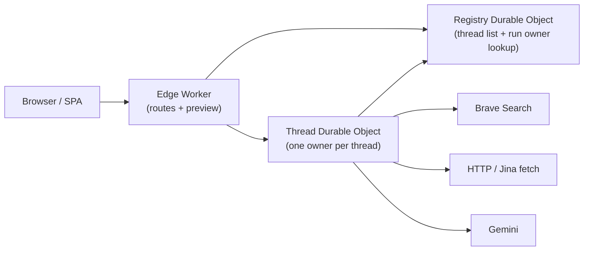

# Architecture

## Document Metadata

- `Doc ID`: `architecture.v0`
- `Version`: `2.2.0`
- `Status`: `authoritative`
- `Kind`: `architecture`
- `Last Updated`: `2026-04-05`
- `Authority`: This is the current source of truth for the actual runtime shape, known failure modes, and target refactor direction.
- `Supersedes`: `architecture.v0@1.1.0`

## Overview

Agentic Search is a generic entity-discovery system for the Agentic Search Challenge. It accepts a natural-language query, generates a plan, discovers web pages, extracts candidate anchors, corroborates those anchors with a small evidence pack, and only then materializes structured rows whose cells stay traceable to evidence.

Two things are true at once right now:

- the app already demonstrates the correct product skeleton:
  - query
  - plan preview
  - progressive result table
  - row details
  - evidence and sources
- the current implementation is still in transition:
  - local tests still use the legacy in-memory runtime path when Durable Object bindings are absent
  - deployed runtime ownership now lives in Durable Objects rather than isolate-local Worker memory
  - the product and debug surfaces were over-coupled
  - request fan-out and trace volume grew before the entity-quality baseline was locked

This document therefore describes both:

- the current architecture as it really exists today
- the target architecture we are actively refactoring toward

## Current Architecture

### Runtime Path Today

- A front Cloudflare Worker serves static assets and `/api/v1/*`.
- The Worker runtime supports fixture, hybrid, and live provider modes.
- Preview remains stateless in the front Worker.
- Deployed thread/run ownership now routes through Durable Objects:
  - one **thread owner Durable Object** per thread
  - one lightweight **registry Durable Object** for thread summaries and `runId -> threadId` lookup
- The current durable truth model is **Durable Object storage snapshots**, not D1 yet.
- Live provider execution currently uses:
  - Brave for search
  - direct fetch/parse for source retrieval
  - Gemini for planning, extraction, and verification

Parallelism with this shape:

- **yes across threads** — different threads can execute on different Durable Objects at the same time
- **serialized within one thread** — a single thread owner coordinates its own run state so trace/results/cancel stay coherent
- outbound provider requests can still be parallelized later, but the ownership boundary is per-thread

### Current Frontend Data Flow

- The main route renders:
  - initial query screen
  - preview stage
  - results workspace
- The results workspace now uses a summary/detail split:
  - active polling loads thread summary + run summary + compact result rows/cells
  - row detail is fetched lazily only when the user selects a row
  - debug trace is no longer loaded as part of normal workspace hydration
- A dedicated debug route exists for full execution inspection.

#### Thread list and `activeThreadId` (client store)

The React thread store (`src/stores/thread-store.ts`) keeps `threads` and `activeThreadId` in sync with `GET /api/v1/threads`, per-thread hydration, and mutations. Two patterns caused real bugs (fixed 2026-04-05):

1. **Overlapping `listThreads()` responses** — If `reloadThreadSummaries` is triggered often (e.g. its callback depended on `activeThreadId`), multiple requests could complete out of order; an older response replaced `threads` with a snapshot that omitted a newly created thread, so the repair effect reset `activeThreadId` to `threads[0]` and the UI jumped to an unrelated thread.
2. **`setActiveThreadId` before hydration** — Calling `setActiveThreadId(newId)` before the new thread was present in `threads` (i.e. before `hydrateThread` finished and `upsertThread` ran) triggered the same repair path and cleared or repointed the active id.

Mitigations in code: a monotonic sequence guard so superseded list responses are ignored; a stable `reloadThreadSummaries` (mount-only) with `activeThreadId` read from a ref for the “pick first thread if none active” branch; optional re-merge of the current active thread from previous state when the server list is briefly stale; **`createThread` awaits `hydrateThread` then sets `activeThreadId`.**

### Current Provider Path

- Preview can come from fixtures or Gemini-backed planning depending on runtime mode and keys.
- Discovery uses Brave in live mode and fixtures otherwise.
- Fetch uses direct HTTP fetch + parse.
- Gemini-backed extraction is now split by source role:
  - list/directory/forum pages emit anchors only
  - entity-specific or official pages can emit grounded row fields
- The default live path is now deterministic and corroboration-first:
  - `discovery pages -> anchor extraction -> corroboration fetches -> finalization`
  - supervisor/rewrite logic stays behind an experiment flag and is off by default
- Validation is folded into corroboration and final ranking rather than handled as a separate late cleanup loop.

### Where The App Was Stalling

The previous main stall pattern came from the client hydration loop:

- active runs polled every `700ms`
- each cycle fetched:
  - thread snapshot
  - run results
  - run events
  - row detail for every visible row
- this created `O(R)` request fan-out per poll cycle, where `R` is row count
- over 30–90 second runs, that caused excessive repeated transfer and UI churn

This refactor changed the product path to:

- poll every `2s` initially, with backoff to `3.5s` and `5s`
- fetch only:
  - thread/run summary
  - compact results
- fetch row detail only on selection
- fetch debug trace only in the debug workspace

## Current Failure Modes

### 1. Polling Fan-out

This was the most concrete performance bug and is the first one addressed by the current refactor.

Remaining risk:
- thread snapshot fetches are still separate from results fetches
- local legacy mode is still in-memory when DO bindings are absent
- the current DO persistence format is coarse-grained snapshot persistence, not normalized D1-backed run truth

### 2. Over-instrumented Product UI

We previously mixed three surfaces together:

- product experience
- debug/trace explorer
- evaluation/ops dashboard

This made the main app noisy, repetitive, and less credible. The product path now defaults to:

- Search
- Details
- Sources
- Run

with the full internals moved to a separate debug workspace.

### 3. Document-vs-Entity Confusion

This remains one of the hardest correctness risks.

Failure mode:
- discovery returns pages
- extraction can be tempted to preserve those pages as final rows instead of canonical entities

Current mitigation:
- rows now carry lineage
- list/directory/forum pages are candidate generators only and do not create visible rows by themselves
- visible rows are created only after at least one grounding source exists
- accepted rows require grounded evidence from one authoritative source or two corroborating sources

This is a guardrail, not a complete solution.

### 4. Trace/Event Bloat

The runtime still emits a lot of trace data, especially in live mode.

What changed:
- product UI no longer drags that trace through normal polling
- debug trace is now loaded separately
- debug UI groups adjacent similar events by default

What remains:
- event generation itself is still verbose
- raw payload duplication remains a cost in the debug path

### 5. Row/State Inconsistencies

Known risk areas:

- row status vs processing state drift
- stage summary vs row state timing mismatches
- heuristic fallback rows degrading into ambiguous states

The model is now explicitly:

- row semantic state:
  - `accepted`
  - `rejected`
  - `uncertain`
  - `conflict`
- row processing state:
  - `fetching`
  - `extracting_anchor`
  - `corroborating`
  - `finalized`
  - `failed`

### 6. Client thread list vs active selection (addressed)

Symptom: after “new thread” and starting from preview, the UI sometimes showed an older thread’s query/results.

Cause: stale or reordered `listThreads()` merges dropped the new thread from `threads` while `activeThreadId` still pointed at it (or pointed at it before it existed), triggering a guard that set `activeThreadId` to the first list entry.

Status: mitigated in the client store as described under **Thread list and `activeThreadId` (client store)** above.

## Target Architecture

### Product View

The product-facing workflow should stay restrained and demoable:

- query
- human-readable plan
- progressive result table
- unmatched partition for rejected rows
- row detail
- cell evidence
- sources
- small execution summary

Only these metrics belong in the main experience:

- stage
- elapsed
- rows discovered
- rows accepted
- search calls
- fetch calls
- llm calls
- cache hit rate
- estimated cost

### Debug View

The separate debug workspace is intentionally engineer-facing and can remain rich:

- grouped execution trace
- provider ledger
- tool/function calls
- raw payloads
- checkpoint timeline
- advanced eval/debug metrics

The hot path now prefers compact machine-usable events over narrative payloads so the debug surface stays useful without dragging large synthetic reasoning blobs through normal execution.

This surface is allowed to be noisy because it is now isolated from the main product story.

### Runtime Stages

The runtime remains stage-driven:

- planning
- discovery
- fetch
- extraction
- evaluation
- canonicalization
- verification
- ranking
- export

Within those stage boundaries, the default live loop is now logically:

- discovery returns pages only
- extraction on list-like pages produces anchors, not rows
- corroboration fetches are launched immediately once plausible anchors exist
- finalization ranks and labels only grounded rows

The durable checkpoint boundaries that matter are:

- `plan persisted`
- `candidate rows created`
- `sources fetched`
- `cells extracted`
- `criteria evaluated`
- `final ranking committed`

### Entity-first Contracts

The backend must distinguish:

- candidate document
- anchor candidate
- corroborated entity draft
- accepted entity row

Rows now carry lineage:

- `suggestedBySourceIds`
- `groundedBySourceIds`
- `sourceOriginClass`

This is the minimum contract needed to keep source pages from silently becoming final entities.

Operational rules now treated as binding by the runtime:

- `targetResults` means desired grounded final rows, not provisional candidates
- the default row URL is the first backing source URL
- website/entity URLs remain cell-level data until corroborated
- no visible row should exist with `sourceCount = 0`

### Lighter Polling And Detail Loading

The target API separation is:

- `GET /api/v1/runs/:runId`
  - authoritative run summary
- `GET /api/v1/runs/:runId/results`
  - compact row and cell summaries
- `GET /api/v1/runs/:runId/results/:rowId`
  - full row detail with evaluations, sources, and evidence
- `GET /api/v1/runs/:runId/debug`
  - debug summary and checkpoint state
- `GET /api/v1/runs/:runId/debug/trace`
  - paginated full trace

## API Contracts

The public contract is documented in [OPENAPI.yaml](/Users/apple/Projects/agentic-insights-dashboard/OPENAPI.yaml).

Current important routes:

- `POST /api/v1/query-plans/preview`
- `POST /api/v1/threads`
- `PATCH /api/v1/threads/:threadId/config`
- `POST /api/v1/threads/:threadId/runs`
- `GET /api/v1/threads`
- `GET /api/v1/threads/:threadId`
- `GET /api/v1/runs/:runId`
- `GET /api/v1/runs/:runId/results`
- `GET /api/v1/runs/:runId/results/:rowId`
- `GET /api/v1/runs/:runId/debug`
- `GET /api/v1/runs/:runId/debug/trace`
- `POST /api/v1/runs/:runId/cancel`
- `GET /api/v1/runs/:runId/export`

Legacy route still present for backward compatibility during transition:

- `GET /api/v1/runs/:runId/events`

## Performance Notes

### Current Complexity

At a high level the runtime is still:

- planning: `O(1)`
- discovery: `O(Q + candidate_docs)`
- fetch: `O(S)`
- extraction: `O(R * C)`
- evaluation and verification: `O(R * K)`

where:

- `Q` = search queries
- `S` = fetched sources
- `R` = candidate rows
- `C` = output columns
- `K` = criteria

### What Actually Hurt

The main problem was not asymptotic class. It was constant-factor blowup:

- per-row detail polling
- repeated full-event transfers
- raw payload duplication
- product UI reading trace-heavy structures it did not need

### Expected Post-refactor Request Shape

For an active run in the product workspace:

- `1 x thread summary`
- `1 x run results`
- `0 x row detail` unless a row is selected
- `0 x debug trace` unless debug workspace is open

That makes the active polling shape effectively constant with respect to row count.

### Latency And Cost Hotspots

The main live cost/latency hotspots remain:

- Brave query count and retries
- fetch latency for slow pages
- Gemini extraction and verification calls
- heuristic fallback when free-tier or trial budgets are exhausted

## Deferred Items

These are still target-state items, not completed implementation facts:

- D1-backed run truth and recovery
- KV-backed cache discipline
- Queue-backed production orchestration
- richer observability backend beyond in-memory trace capture
- provider fallbacks
- browser-rendered fetch path

## Migration Plan

### Step 1: Product/Debug Split

Completed in this pass:

- main product view simplified
- debug workspace moved to a separate route
- row detail is now lazy-loaded

### Step 2: Entity Quality Baseline

Current priority:

- reduce page-as-entity leakage
- preserve lineage
- keep human-readable criteria in product mode

### Step 3: Runtime Compression

Next:

- reduce event verbosity
- compress repeated operations at write-time, not only read-time
- remove remaining raw payload duplication where not needed

### Step 4: Infra Truth Model

After the entity-quality and product-flow baseline is stable:

- move durable run truth to D1
- use KV only for cache
- restore the original queue-backed production intent with a simpler API surface
