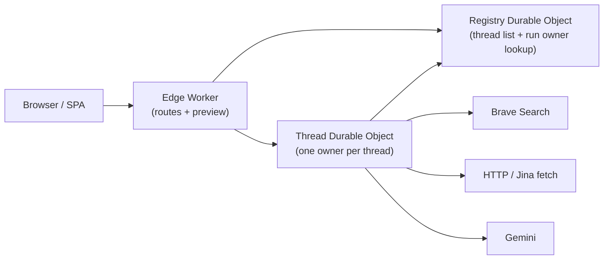
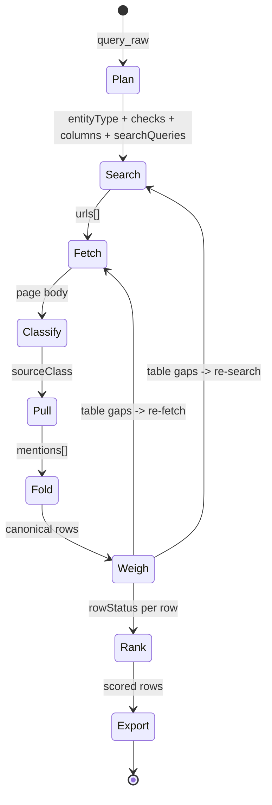

# Deep Research Datasets

**`query_raw` → grounded entity table**  
Brave search · Gemini planning/extraction · Cloudflare Worker

---

## Cloudflare AI Assignment Fit

- **LLM**: Gemini powers query planning, extraction, verification, and query rewriting.
- **Workflow / coordination**: the runtime is designed around a Worker entrypoint plus per-thread coordination, with the current repo moving from an in-memory local path toward Cloudflare-owned thread execution.
- **User input**: the app exposes a web UI where users enter a research query, edit criteria, add output columns, and inspect results.
- **Memory / state**: the current local path uses in-memory state for iteration speed; the intended Cloudflare shape uses Durable Objects for thread ownership and D1/KV for persistent state and cache.

The repo includes both the product shell and the runtime logic we used to test and refactor the search pipeline.

---

## Runtime Infra



- Preview stays stateless in the edge Worker.
- Thread creation, run execution, results, trace, and cancel route to a **per-thread Durable Object owner**.
- A lightweight **registry Durable Object** tracks thread summaries and `runId -> threadId` ownership so results/debug/cancel hit the correct owner.
- Parallelism: **yes across threads**. Each thread owner serializes its own state for consistency, but different threads can run concurrently on different Durable Objects.

---

## The Hard Problems

**1. Entity kind from raw query**
- Query names no type. Planner must infer from intent.
- `"best pizza in Brooklyn"` → `restaurant`
- `"YC W24 healthcare startups"` → `startup`
- Wrong kind → wrong checks → wrong search targets

**2. Checks from raw query**
- Hidden marks in user intent: location, cohort, category, date
- Split: `hard_filter` (must pass) vs `soft_signal` (weight toward)
- Output shape per check: `{label, kind, fieldHint, operatorHint, valueHint}`
- Planner must not collapse all marks into keyword variants of the query

**3. Query → planner input**
- `query_raw` → `{entityType, criteria[], columns[], searchQueries[], budgets}`
- Search queries must seek missing proof — not rewrites of the same query
- Failing here means all downstream stages run on the wrong search space

**4. Page ≠ Row**
- Roundup page → many entity candidates, not one row
- Official site → one entity, many facts
- Forum thread → weak backing only
- Must class the page before pulling; wrong class → wrong row count
- This is the biggest single source of bad output

**5. Folding across pages**
- Same thing named differently across Yelp, official site, guide, review
- Group by: `normName(a) == normName(b)` OR `jaccardTokens(a,b) ≥ 0.5`
- Merge: keep highest-weight cell per key; keep highest-weight check per label
- URL-only dedup cannot catch this

**6. Cell traceability**
- Every filled cell must carry backing text (`evidenceText`)
- Weight drives merge winner; lower-weight cell is dropped, not blended
- Null policy: `dash` — not blank string

---

## Run State Machine



`sourceClass`: `roundup` · `entity_page` · `official` · `directory` · `forum`

---

## Three Objects

The system only makes sense if these three objects stay separate:

| Object | What it is | Role | What it is not |
|---|---|---|---|
| **page** | One fetched source document with raw text, metadata, and a `sourceClass`. Examples: roundup, official site, directory, review, forum thread. | Retrieval and evidence unit. Pages are what we search, fetch, classify, cache, and cite. | Not a result row. A useful page may mention many entities. |
| **mention** | One candidate entity pulled from one page. A single page can yield zero, one, or many mentions. | Extraction unit. Mentions hold page-local cells, checks, confidence, and evidence snippets before any cross-source merge happens. | Not canonical. The same real thing may appear as many mentions across many pages. |
| **row** | The merged canonical entity built from one or more mentions judged to refer to the same thing. | Output unit. Rows are what get ranked, filtered, exported, and shown in the final table, with cells linked back to source evidence. | Not a page, and not limited to one source once merge succeeds. |

---

## Row States

**kind:** `accepted` · `rejected` · `uncertain` · `conflict`  
**step:** `pending` · `verifying` · `finalized` · `failed`

---

## Fold Logic (`dedup.ts`)

```
normName(s):
  lowercase → strip (the|a|an) → strip non-alphanumeric → collapse spaces

jaccardTokens(a, b):
  tokenSet(a), tokenSet(b) → |intersect| / |union|

group if:
  normName(a) == normName(b)
  OR jaccardTokens(a, b) >= 0.5

merge group:
  seed      = highest-score row
  cells     = max-weight per key across group
  checks    = max-weight per label across group
  rowStatus = conflict > uncertain > rejected > accepted
  score     = max across group
```

---

## Cost Shape

| Stage | Bound |
|---|---|
| Plan | O(1) |
| Search | O(Q + S) |
| Fetch | O(S) |
| Pull | O(R × C) |
| Weigh | O(R × K) |

`Q`=queries · `S`=pages · `R`=rows · `C`=columns · `K`=checks

Blowup in practice: not asymptotic. Per-row polling and repeated full-event transfer were the real hotspots.

---

## Open Gaps

- Roundup expansion: should yield N rows; currently yields 1
- Cross-page fold too weak for local business queries
- Page misclass silently routes to wrong pull path
- Long roundup pages time out on single-call extraction
- Local tests still use the legacy in-memory runtime path when Durable Object bindings are absent

---

## Setup

```bash
npm install
npm run dev   # → http://localhost:8080
```

Copy `.env.local.example` → `.env.local` for live Brave + Gemini keys.

| Script | |
|---|---|
| `npm run dev:live` | live keys |
| `npm run build` | build |
| `npm run test` | unit |
| `npm run test:e2e` | e2e |
| `npm run cf:deploy` | deploy |

---

## Further Reading

- [ARCHITECTURE.md](ARCHITECTURE.md)
- [OPENAPI.yaml](OPENAPI.yaml)
- [PROMPTS.md](PROMPTS.md)
- [Submission draft](knowledge/submission/assignment-submission-draft.md)
- [Notebooks](knowledge/notebooks)
